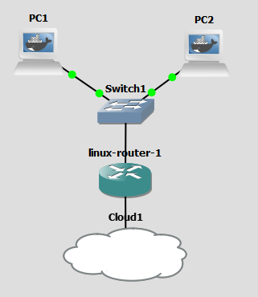

# Linux-based router
This router uses the Dockerfile to create an Ubuntu image with iptables.
It can be used in a simple network like this

<p align="center">
  
</p>

In this example, it is assumed the following interface configuration

- eth0 (192.168.0.1) Default gateway for nodes connected to switch
- eth1 (DHCP) Internet connection

In order to configure routing using this simple network configuration, we use
the following iptables commands:

```
echo 1 > /proc/sys/net/ipv4/ip_forward
iptables -t nat -A POSTROUTING -o eth1 -j MASQUERADE
iptables -A FORWARD -i eth1 -o eth0 -m state --state RELATED,ESTABLISHED -j ACCEPT
iptables -A FORWARD -i eth0 -o eth1 -j ACCEPT
route add default gw 192.168.0.1 eth0
```

First command enables port forwarding. The next one configures NAT at postrouting level on eth0.
The third and fourth commands enable forwarding on both interfaces. Finally, we add the default
gateway for routing purposes.

# Build Docker image
You can build the image using

```
docker build -t local:ubuntu-router .
```

# Use

This is simple configuration is intended for using as a replacement of Cisco Router in GNS3.
In order to use it, build this image in the GNS3 VM and create a new template with, at least,
two interfaces (eth0 and eth1). It should be added that this simple image can be used as a 
replacement of Cisco Firewalls. We only have to use the required iptables commands.

If you need to save your work, you can use the volume created in /home/iptables. It can be useful,
because when you restart the GNS3 VM you will lost all files/changes. In order to save iptables changes
you can use

```
iptables-save > /home/iptables/router-config # Save rules
iptables-restore < /home/iptables/router-config # Load rules after restart
```
Also, you can load rules automatically using shell scripts. For example, when you define the GNS3 template, 
it allows you to start container using commands.
